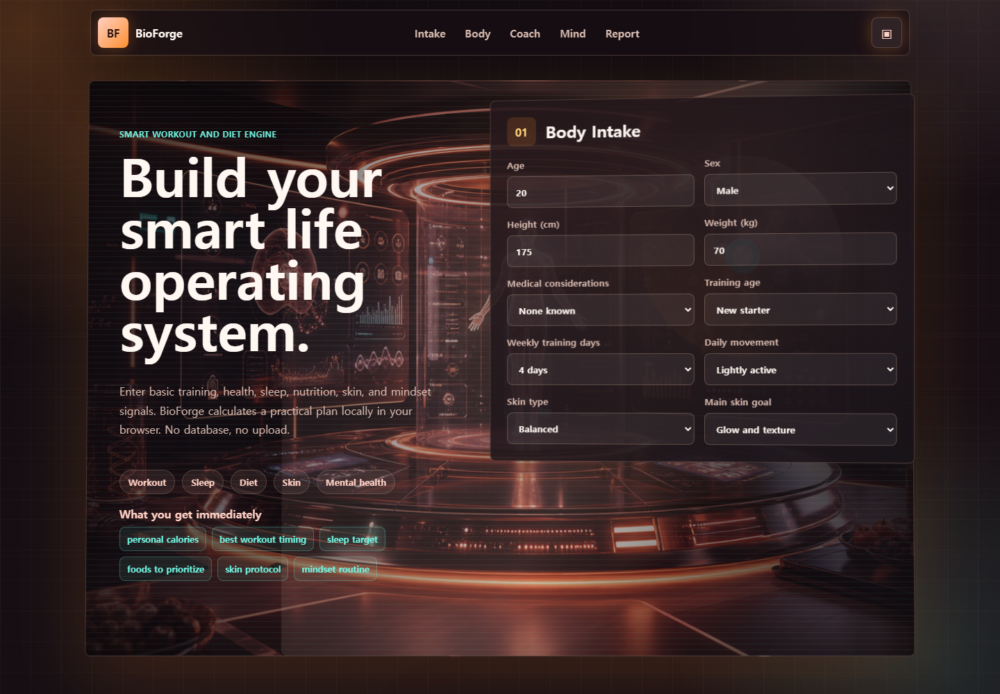

# BioForge



BioForge is a small web project I made to explore how a personal health dashboard could feel more like a smart assistant than a normal calculator.

The idea is simple: the user enters basic information about their body, training level, sleep, skin type, stress, and goals. The page then builds a practical routine for workouts, sleep, diet, skin care, and mental habits.

Live site: https://bioforge-smart-life-20260710163312.netlify.app  
Portfolio: https://doyun-shin-portfolio-20260709204728.netlify.app

## Why I Made It

I wanted to make a website that combines three things I care about:

- fitness and diet planning
- clean data-based decision making
- futuristic UI design

Most routine apps feel either too plain or too complicated, so I tried to make this one feel direct, visual, and easy to understand. It is not connected to a database. The input values stay in the browser and the plan is generated on the page.

## Main Features

- body intake form for age, height, weight, sex, training level, and daily activity
- goal selection for different body types, such as lean, muscle build, recomposition, and performance
- mental goal selection for calm, success, confidence, focus, connection, and happiness
- local estimates for BMI, BMR, TDEE, calories, protein, carbs, and fat
- routine cards for workout, sleep, diet, skin care, and mental health
- resource cards for exercise, nutrition, sleep, sun safety, and stress management
- print and screenshot-friendly result board
- developer contact section that links back to my portfolio

## Design Notes

The design uses a rose-gold and orange cyberpunk style. I wanted the first screen to feel like a smart health lab, so I used a high-resolution hero image, glowing panels, scan-line effects, and a rotating HUD-style reactor.

I avoided using any copyrighted character, logo, or brand style directly. The design is meant to feel futuristic and cinematic, but still original.

## Code Structure

```text
smart-health-lab/
├── index.html
├── styles.css
├── app.js
├── README.md
└── assets/
    ├── favicon.svg
    ├── hero-cyber-lab.png
    ├── medical-figure.svg
    ├── food-grid.svg
    ├── neural-panel.svg
    ├── developer-preview.svg
    └── screenshots/
        └── bioforge-preview.png
```

## How The Code Works

`index.html` contains the main page sections: the intake form, sensor visual, coach cards, body goal selector, mental goal selector, report board, developer CTA, and science links.

`styles.css` handles the visual system. Most of the cyberpunk feeling comes from the background layers, glass panels, responsive grids, card hover states, and animated HUD elements.

`app.js` handles the interactive part. It reads the form inputs, estimates maintenance calories, updates the live BMI/TDEE display, generates routine text, renders resource cards, and controls the screenshot mode.

## Health Note

This is an educational demo, not medical advice. The routine text is based on general public-health style guidance, but users with pain, medical conditions, medication concerns, eating disorder history, pregnancy, or serious mental-health concerns should work with a qualified professional.

## Run Locally

You can open `index.html` directly, or run a simple static server:

```bash
python -m http.server 5182
```

Then open:

```text
http://127.0.0.1:5182
```
